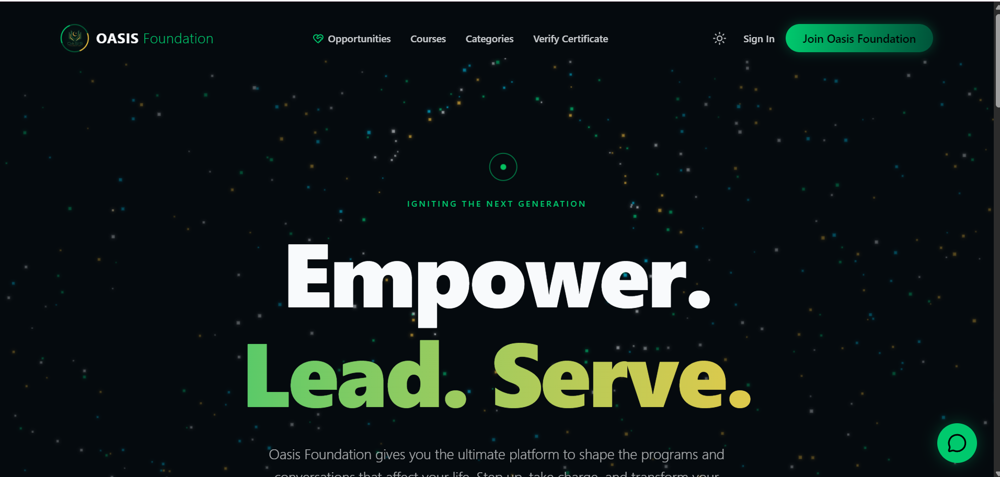
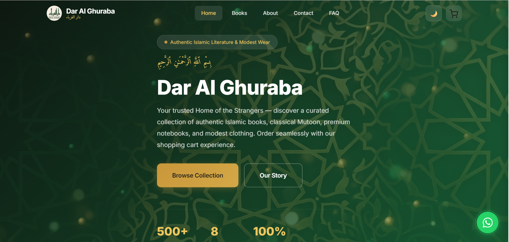

# Hi, I'm Nalain Muhammad 👋

**Data Science Undergraduate | Full-Stack Developer**

[Portfolio](https://www.nalainmuhammad.me/) ·
[LinkedIn](https://www.linkedin.com/in/nalain-muhammad-b50a5830b) ·
[Email](mailto:nalainbhatti6@gmail.com)

## About Me

I am a third-semester BS Data Science student at the University of Engineering and Technology, Lahore, interested in full-stack development, database engineering, and applied machine learning.
I enjoy turning practical requirements into working applications, from campus transport systems to e-commerce and learning platforms.
Alongside my studies, I work on freelance projects and am currently a Python Programming Intern at DecodeLabs.
I am strengthening my understanding of data structures, algorithms, software engineering, and data analysis through coursework and practical projects.

- 🔭 Currently working on the OASIS Skills and Certification Portal.
- 🌱 Learning DSA in C# and C++, alongside Python for data analysis.
- 💼 Interested in internships, freelance projects, and opportunities to learn.
- 📍 Based in Lahore, Pakistan.

## Skills and Technologies

### Languages and Web Technologies

### Frameworks and Backend Development

### Databases and Development Tools

| Category | Technologies |
|----------|--------------|
| Programming and Query Languages | Python, C#, JavaScript, SQL |
| Web Technologies | HTML5, CSS3 |
| Backend Development | Flask, ASP.NET Core MVC, Node.js, Express.js, REST APIs |
| Databases | SQL Server, MongoDB, PostgreSQL |
| Libraries and Frameworks | Entity Framework Core, SignalR, Next.js, Django, Tailwind CSS |
| Development Tools | Git, GitHub, VS Code, Visual Studio, SSMS |
| Currently Learning | C++ for DSA, Data Analysis, Applied Machine Learning |

## Featured Projects

### 🎓 OASIS Skills and Certification Portal

**Status: In development**

A learning and certification platform I am developing for OASIS Foundation to support skills education and community participation.

The platform brings together course discovery, enrollment, modular learning content, learner profiles, and certificate verification. Its opportunities section covers volunteer roles, programs, events, workshops, and campaigns.

**Technologies:** Next.js, Django, PostgreSQL, Tailwind CSS

[Visit Portal](https://www.oasisportal.tech/) |
[Source Code](https://github.com/nalainmuhammad/oasis-skills-portal)

### 🛍️ Dar Al Ghuraba E-Commerce Platform

A freelance e-commerce project with a database-driven storefront and a custom backend API.

The project includes server-side price validation, Stripe payment integration, webhook-based order updates, and WhatsApp ordering.

**Technologies:** Node.js, Express.js, MongoDB, JavaScript, Stripe

[Source Code](https://github.com/nalainmuhammad/dar-al-ghuraba-books)

### 🚌 UniRide-CTMS

A campus transport management system developed as a combined Object-Oriented Programming and Database Systems semester project.

I led the architectural redevelopment within a four-person team. The system includes a normalized relational database, real-time tracking, capacity-aware bus allocation, and QR-based boarding and attendance.

**Technologies:** C#, ASP.NET Core MVC, SQL Server, Entity Framework Core, SignalR

[Source Code](https://github.com/nalainmuhammad/UniRide-CTMS)

### 🚏 Campus Transport Management System

My first-semester full-stack project, created to support campus transport workflows involving students, routes, vehicles, and drivers.

I developed the core Python and Flask backend and worked on interface design with a project partner. This project became the foundation for the later UniRide-CTMS redevelopment.

**Technologies:** Python, Flask, HTML, CSS

[Source Code](https://github.com/nalainmuhammad/UET-CTMS)

## Education

**BS Data Science**  
University of Engineering and Technology, Lahore  
2025–2029 — Expected graduation  
Currently in Semester 3

**Intermediate in Computer Science** 
Fazaia Inter College, Kamra, Pakistan 
**Dates:** 2023–2025 
**Grade:** A

**Matriculation in Computer Science**
Army Public School and College System, Attock Cantt, Pakistan 
**Dates:**2010-2023 
**Grade:** A+ 

## Experience

- **Python Programming Intern — DecodeLabs**  
  July 2026–Present  
  Working on Python programming, backend architecture, data management, and logic verification.

- **Freelance Full-Stack Developer**  
  2026–Present  
  Developing web applications involving interfaces, backend APIs, databases, payment integration, and deployment.

## Certifications

- **CS50's Introduction to Programming with Python** — Harvard University, July 2026
- **Introduction to SQL Server** — DataCamp, July 2026
- **Introduction to Front End Development** — Simplilearn, January 2026
- **Introduction to HTML** — Simplilearn, January 2026

## Contact

- **Portfolio:** [nalainmuhammad.me](https://www.nalainmuhammad.me/)
- **GitHub:** [@nalainmuhammad](https://github.com/nalainmuhammad)
- **LinkedIn:** [Nalain Muhammad](https://www.linkedin.com/in/nalain-muhammad-b50a5830b)
- **Email:** [nalainbhatti6@gmail.com](mailto:nalainbhatti6@gmail.com)